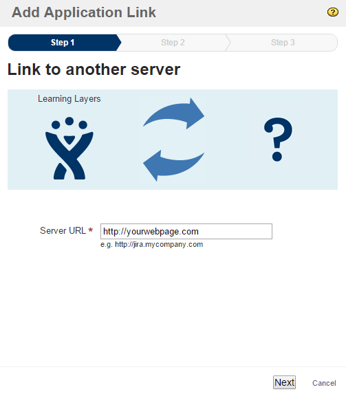
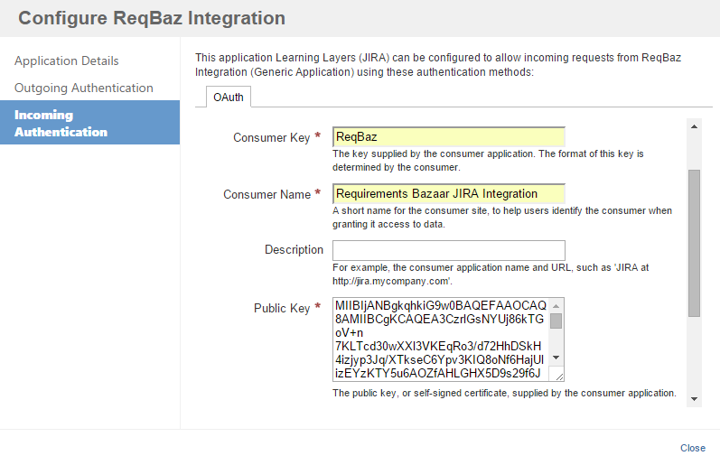

Setting up JIRA
-------------

As we would like to be able to post in the name of JIRA users, we need to use JIRA's OAuth 1 authentication to get access to post issues. JIRA OAuth method are using an RSA based identification between the third party services (here our integration service) and the JIRA itself. So in order to use and set up properly we need to generate our private-public key pairs and additional key files.

### Generate key files
As a tool we will need an OpenSSL installation, so continue reading only once you have already set that up.

#### Generate private key
First we will need a private key as a base for the authentication process. To generate run the following command in the console/terminal:

```console
openssl genrsa -out private_key.pem 2048
```
This private_key.pem file, which we just created, is used only as a starting point to generate other key files, the file itself won't be used directly in the authentication process.

> **Note:** As this file contains your private key, you should **keep the file privately and securely**

#### Generate binary private key
Because we need to use the private key in our Java service, where we have to sign the requests going to the JIRA using SHA1 algorithm, we need to access the private key somehow. The solution to handle private keys is based on [this article](http://codeartisan.blogspot.de/2009/05/public-key-cryptography-in-java.html) and as a result we need our private key in a binary format, which is easier to handle in code. You can generate this binary private key file out of your previously generated private_key.pem file by running this console command:

```console
openssl pkcs8 -topk8 -inform PEM -outform DER -in private_key.pem -out private_key.der -nocrypt
```

In the code you have to use this private_key.der file.

> **Note:** As this file contains your private key, you should **keep the file privately and securely**

#### Exporting public key
Our last step in the generation process is to get the public pair of our previously generated private key. To get this last needed pieces of information run the following command:

```console
openssl rsa -in private_key.pem -pubout > mykey.pub
```
This is a simple text file, you can easily read in any text editor and as it is you public key, you don't really have to keep it as a big secret.

### Connect integration service to JIRA
Of course JIRA has to know about our service to trust in its requests, so we need to register our service in JIRA.
What we need is in JIRA is called as a **new application link**. You can find the menu for it somewhere inside the administration section.

#### New application link
In the first window give the url of your server. It does not influence the connection, you can put here anything.



Then **press next** and in Step2 give an arbitrary name of your application.


Then **press create**. Now you should see in the list of your application links.

#### Configure application link
But our job is not yet done, we still have to set up some authentication parameters to enable incoming/outgoing requests from the service. So **press configure** on the application link you just created.
Then **go to the Incoming Authentication** and fill the form with the following data:



- *Consumer key*: It is an arbitrary chosen alphanumeric key, which is shared between the JIRA and your service

> **Note: The consumer key must match in the JIRA and in your service!**

- *Consumer name:* A short name for your project, so users can identify your project and can trust to allow access.
- *Public key:* Fill this field with the public key you generated. Open the mykey.pub file and copy the content between the header and footer lines into this field.

> **Note:** Do not include the lines with -----BEGIN/END PUBLIC KEY-----

Leave the other fields intact and save the configuration and you are good to go, everything should work.
